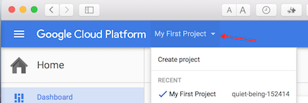
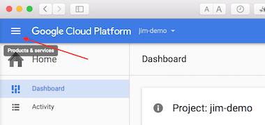
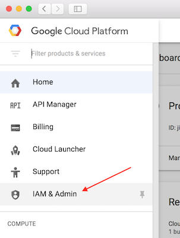
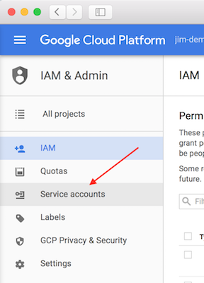
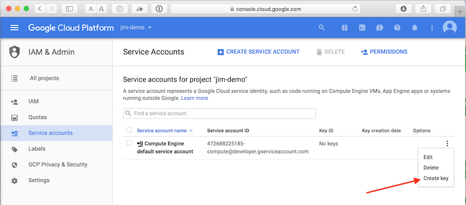
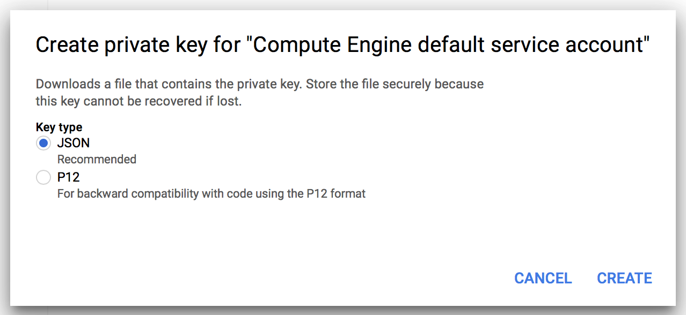

# Running Jim in Google Cloud with Kubernetes

The followin describes a demo of running Jim on the Google Cloud with Kubernetes using the Google Cloud and K8s CLIs.
 There may be other ways than the commands below but this is what worked for us as a simple demo.

### Prerequisites

You need to have an account on Google Cloud (the free introductory account is fine for this).

From your [Google Cloud Platform](https://console.cloud.google.com/home/dashboard) home page you will need to have 
created a project to use for this demo. Google Cloud will have created a default "My First Project" but you can 
create a new project by selecting `Create project` from the drop down menu at the top left of the home page.



For this demo we are calling our project `jim-demo` as project names need to be at least 4 characters `jim` is not 
enough. Google Cloud will also give your project an ID, which will be unique in the cloud. If you are lucky enough 
to have picked a project name that nobody has used before then the ID will be the same as the name, but is mot 
often not.  

You will need to obtain the keys for the default service account for the project. Using the main menu at the
top left of the Google Cloud Platform page:



From the main menu select "IAM & Admin":



and then from the left hand panel that opens select "Service accounts":



On the Service Accounts page you should see the default compute engine service account. 
Select `Create Key` option from the drop-down menu at the right hand side of the table. 



A "Create private key" pop-up will open as shown below:



Leave the JSON option selected and click "CREATE", this will download a json key file to your downloads folder. 
Rename this file to something sensible, for example `jim-project-key.json`, and move it somewhere safe. The set the 
GOOGLE_APPLICATION_CREDENTIALS environment variable to point to the fully qualified name of the file:

```
    export GOOGLE_APPLICATION_CREDENTIALS=jim-project-key.json
```

### Install the Google Cloud CLI

You can download and install the Google Cloud CLI from [https://cloud.google.com/sdk/] with install 
docs here [https://cloud.google.com/sdk/docs/]

Now that the `gcloud` common line tool is installed, set the Google Cloud compute zone 
with the following command:

```
    gcloud config set compute/zone europe-west1-b 
```

This will set the compute zone to `europe-west1-b` but you can set it to any valid compute zone you wish.

Set the project that `gcloud` will use to the name of your Google Cloud project:
 
```
    gcloud config set project PROJECT_NAME
``` 

replacing `PROJECT_NAME` with the name of your Google Cloud project.

### Build and Push the Docker image

From the root folder run:

```
        docker build -t jim:1.0 .
```

You will now have a local Docker image called `jim:1.0` that needs to be pushed to Google Cloud. 
You can use the following commands to tag and push the image: (replace `PROJECT_ID` with the ID of your Google Cloud project)
 
```
    docker tag jim:1.0 gcr.io/PROJECT_ID/jim:1.0
    gcloud docker push gcr.io/PROJECT_ID/jim:1.0
```

The image `gcr.io/PROJECT_ID/jim:1.0` will now be installed into your project's image repository in Google Cloud. 
If you run the command
```
    gcloud docker images
```  
you should see your image listed in the cloud container repository.

### Install Kubernetes on Google Cloud

You could just use Google Cloud's built in container support to run Jim but the purpose of this demo is to install 
and use K8s. The following commands will set up K8s on your Google Cloud 

First install the `kubectl` tools, which is the K8s CLI using this command:

```
    gcloud components install kubectl
```
   
Now create a K8s cluster in the cloud using the following commands: 
(the commands may take a few minutes to run as they will be initialising compute engines).    
```    
    gcloud container clusters create cluster-1
    gcloud config set container/cluster cluster-1
    gcloud container clusters get-credentials cluster-1
```

You will now have a K8s cluster running in Google Cloud. Although this demo uses the command line tool `kubectl` 
you can connect to the K8s dashboard by using the [kubectl proxy](http://kubernetes.io/docs/user-guide/kubectl/kubectl_proxy/) 
command that will run a local proxy to connect you to the dashboard in the cloud. Open a command prompt and 
run the following command:

```
    kubectl proxy --port 8001
```   

This will start the proxy process and the dashboard can be accessed at [http://localhost:8001/ui](http://localhost:8001/ui)

To stop the proxy just type Ctrl-C.
  
### Run Jim using Kubernetes
  
Now that K8s is running and the Jim Docker image has been pushed to Google Cloud it is possible to execute a cluster
  of Jim processes using the kubectl command line tool. The following command will start a cluster of Jim nodes:
  (remembering to replace PROJECT_ID with the ID of your Google Cloud project, the same as the one used to push the image)

```
    kubectl run jim --image=gcr.io/PROJECT_ID/jim:1.0 --port=3000
```

K8s should now have created a deployment called `jim`. You can check this with the following command:

```
    kubectl get deployment jim
```

  which should display something like:
  
```
NAME      DESIRED   CURRENT   UP-TO-DATE   AVAILABLE   AGE
jim       1         1         1            1           1m
```  

You can scale up the deployment using the following command:   

 ```
    kubectl scale deployment jim --replicas=3
 ```

If you run `kubectl get deployment jim` again you should see there are now three processes:

```
NAME      DESIRED   CURRENT   UP-TO-DATE   AVAILABLE   AGE
jim       3         3         3            3           5m
```

At the moment although there are three containers running they are not exposed to the outside world. 
Execute the following command to expose the Jim service externally:

```
    kubectl expose deployment jim --type="LoadBalancer"
```

The Jim service will be created, which can be checked using:

```
    kubectl get services jim
```

It may take a few minutes to assign an external IP to the service so initially the above command might display
something like this:

```
NAME      CLUSTER-IP     EXTERNAL-IP   PORT(S)    AGE
jim       10.3.251.166   <pending>     3000/TCP   18s
```

where the external-ip is in the `<pending` state. After a few minutes though this should change to something like 
this:

```
NAME      CLUSTER-IP     EXTERNAL-IP      PORT(S)    AGE
jim       10.3.251.166   104.199.22.186   3000/TCP   2m
```

The Jim service can now be accessed on http://104.199.22.186:3000

#### Cleaning Up

To remove Jim from K8s use the following command

```
    kubectl delete service,deployment jim
```

To remove the K8s cluster from your Google Cloud use this command:

```
    gcloud container clusters delete cluster-1
```